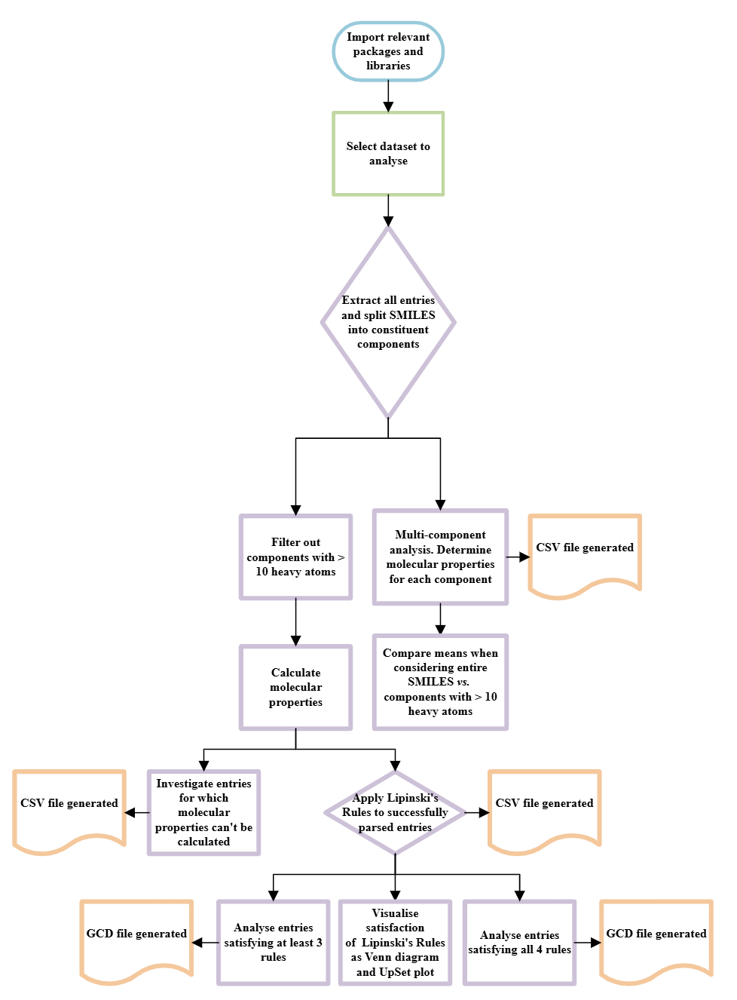

# Drug-Like Subset of the Cambridge Structural Database (CSD)

## About

This is a Sandpit Team Project within the ILESLA DPhil at the University of Oxford, in collaboration with the Cambridge Crystallographic Data Centre (CCDC).

## Table of Contents

- [Description](#description)
- [Code Architecture](#code-architecture)
- [Dependencies](#dependencies)
- [Installation](#installation)
- [Executing the Programme](#executing-the-programme)
- [Contributors](#contributors)
- [Contact Information](#contact-information)
- [References](#references)

## Description

The discovery and subsequent delivery of a novel drug to market is extremely
expensive and laborious, with pipelines taking on average 15 years and costing
$2 billion. Computational methods, like virtual ligand screening, have been
developed to redcue attrition rates in drug discovery campaigns but these are
often limited by the synthetic inaccessibility of proposed compounds, the
physically unrealistic binding poses, or the incompatibility of their hysicochemical properties with human physiology.

The aim of this project is to provide a comprehensive dataset of compound
crystal structures that are 'drug-like'. By stratifying the Cambridge
Structural Database based on common properties observed in FDA approved drugs,
this code aims to assist drug discovery teams by allowing for proposed small
molecule drug candidates to be analysed through the:

- Evaluation of synthetic feasibility
- Assessment of ligand binding modes
- Improvement of predicted bioavailability

Overall, this dataset will assist with the acceleration of hit-to-lead discovery, lessening of costs, and reduction of drug attrition rates.

## Code Architecture



The first part of the code requires the user to select what dataset to extract from the CCDC by uncommenting/commenting the relevant lines of code.
The code has been written so no other user input is required.

Then, components with less than 10 heavy atoms are dropped, which will include waters, halide ions, and other non-drug-like components.
Lipinski's Rules are only applicable to small molecule organic compounds, not metals, so this will reduce unnecessary computational power
when molecular properties (including hydrogen bond acceptor count (HBA), calculates hydrogen bond donor count (HBD), Wildman-Crippen logP (logP),
and molecular weight (MW)) are calculated using the RDKit toolkit. Entries for which molecular properties are unable to be calculated are deposited into
a separate CSV file. To the successfully parsed entries, Lipinski's Rule of 5 are applied by assigning a binary digit to the molecular property entry.

The resulting dataset is analysed, with results visualised as histograms, a Venn diagram, and an UpSet plot.

Additionally, entries satisfying 3 and 4 rules are analysed, with CCDC compatible GCD files generated.

## Dependencies

This code has been written for Python.

Prior to running the code, a licence to use the CSD must be obtained. Contact your institution or the [CCDC website](https://www.ccdc.cam.ac.uk/).

## Installation

In order to handle this dataset, the CSD Python API must be installed in a relevant environment using conda.

Install the following packages in the relevant environment: rdkit, venn, upsetplot.

## Executing the Programme

### How to Extract CSD Entries

- To extract the Drug Subset of the CSD (a compilation of every published crystal structure containing an approved drug molecule)<sup>1:

```python
io.EntryReader(subset=io.Subsets.DRUG)

```

- To extract the entire CSD:

```python
io.EntryReader('CSD')

```

## Contributors

This project was carried out by Zeynep Baykam, Naomi Costello, Gurleen Kaur,
and Dani Taverner at the University of Oxford. Assistance and guidance was
provided by Alexander Hasson at the Oxford Protein Informatics Group and
Jasmeen Tatani at the Department of Atmospheric, Oceanic, and Planetary
Physics, University of Oxford. The project was proposed and supervised by
Diana Kondinskaia and Dr Bojana Popovic at the CCDC.

## Contact Information

Zeynep Baykam - <zeynep.baykam@gtc.ox.ac.uk>

Naomi Costello - <naomi.costello@linacre.ox.ac.uk>

Gurleen Kaur - <gurleen.kaur@lincoln.ox.ac.uk>

Dani Taverner - <daniela.taverner@seh.ox.ac.uk>

## References

1. Bryant, M. J. et al. The CSD Drug Subset: The Changing Chemistry and Crystallography of Small Molecule Pharmaceuticals. J. Pharm. Sci. 108, 1655–1662 (2019).
